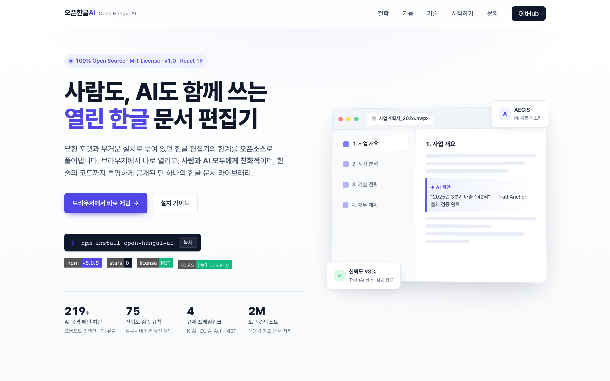

<div align="center">

# 오픈한글AI · Open Hangul AI

**한글(HWPX) 문서를 위한 차세대 오픈소스 웹 에디터** **Open-source web editor &
React component library for Korean (HWPX) documents.**

[](https://www.npmjs.com/package/open-hangul-ai)
[](https://www.npmjs.com/package/open-hangul-ai)
[](./LICENSE)
[](https://www.typescriptlang.org/)
[](https://reactjs.org/)
[](https://vitejs.dev/)
[](https://github.com/kwangilkimkenny/open-hangul-ai)
[](http://makeapullrequest.com)

🌐 **[Live Demo / 체험하기](https://kwangilkimkenny.github.io/open-hangul-ai/)**
· 📦 **[npm](https://www.npmjs.com/package/open-hangul-ai)** · 🐛
**[Issues](https://github.com/kwangilkimkenny/open-hangul-ai/issues)**

</div>

<p align="center">
  <a href="https://kwangilkimkenny.github.io/open-hangul-ai/">
    
  </a>
</p>

> **Languages / 언어:** [한국어](#한국어) · [English](#english)

---

<a id="한국어"></a>

## 🇰🇷 한국어

오픈한글AI는 한컴오피스의 표준 문서 형식인 **HWPX** 를 비롯해 PDF, DOCX, XLSX,
PPTX 까지 단일 React 컴포넌트로 다루는 오픈소스 웹 에디터입니다. 한컴 한글이
설치되지 않은 환경에서도 브라우저만으로 문서를 열어보고, 편집하고, 다시 저장할
수 있습니다.

### ✨ 주요 특징

- **🇰🇷 한글 문서 네이티브 지원** — HWPX/HWP 파일을 변환 없이 직접 파싱·렌더링
- **📄 멀티 포맷** — HWPX · PDF · DOCX · XLSX · PPTX 9개 포맷 지원
- **🤖 AI 통합** — OpenAI/Anthropic/Google 기반 문서 분석·요약·작성 지원
- **⚛️ React 친화적** — TypeScript 정의 포함, peer dependency 만 React 18+
- **🎨 자유로운 커스터마이징** — 테마/툴바/패널 단위로 분리된 컴포넌트 구조
- **🔒 프라이버시 우선** — 문서 파싱은 클라이언트에서 수행, 외부 전송 없음
- **🪶 가벼운 번들** — manualChunks 기반 코드 스플리팅으로 필요한 기능만 로드

### 📸 미리보기

<table>
<tr>
<td align="center" width="50%">
  <br/>
  <sub><b>공식 사이트</b><br/>kwangilkimkenny.github.io/open-hangul-ai</sub>
</td>
<td align="center" width="50%">
  <br/>
  <sub><b>웹 에디터</b><br/>HWPX 문서 편집 화면</sub>
</td>
</tr>
</table>

전체 페이지 캡처:
[docs/assets/screenshots/landing-full.png](docs/assets/screenshots/landing-full.png)

### 📦 설치

```bash
npm install open-hangul-ai
# 또는
yarn add open-hangul-ai
pnpm add open-hangul-ai
```

### 🚀 빠른 시작

```tsx
import { HWPXViewer } from 'open-hangul-ai';
import 'open-hangul-ai/styles';

export default function App() {
  return <HWPXViewer fileUrl="/sample.hwpx" width="100%" height="600px" />;
}
```

통합 앱 형태로 사용하려면 `HanViewApp` 을 임포트합니다.

```tsx
import { HanViewApp } from 'open-hangul-ai';
import 'open-hangul-ai/styles';

export default function DocumentApp() {
  return (
    <HanViewApp
      config={{
        theme: 'light',
        toolbar: { enabled: true, position: 'top' },
        aiPanel: { enabled: true, provider: 'openai' },
      }}
      onFileLoad={file => console.log('파일 로드:', file)}
      onError={err => console.error(err)}
    />
  );
}
```

### 📖 주요 컴포넌트

| 컴포넌트                         | 용도                                     |
| -------------------------------- | ---------------------------------------- |
| `HanViewApp`                     | 툴바·뷰어·AI 패널이 결합된 완성형 에디터 |
| `HWPXViewer`                     | HWPX 단일 뷰어 컴포넌트                  |
| `HanViewProvider` / `useHanView` | 외부에서 상태·설정 주입을 위한 컨텍스트  |
| `AIDocumentController`           | AI 문서 분석·요약·생성 클라이언트        |
| `DocumentStructureExtractor`     | HWPX 문서 구조 추출 유틸리티             |

### 📚 지원 파일 형식

| 형식 | 열기 | 편집 | 내보내기 |
| ---- | :--: | :--: | :------: |
| HWPX |  ✅  |  ✅  |    ✅    |
| HWP  |  ✅  |  ❌  |    ❌    |
| PDF  |  ✅  |  ❌  |    ✅    |
| DOCX |  ✅  |  ✅  |    ✅    |
| XLSX |  ✅  |  ✅  |    ✅    |
| PPTX |  ✅  |  ✅  |    ✅    |

### 🔧 개발 환경

- Node.js 16 이상
- React 18 / 19 (peer)
- TypeScript 5.x (선택)

저장소 클론 후 직접 빌드하기:

```bash
git clone https://github.com/kwangilkimkenny/open-hangul-ai.git
cd open-hangul-ai
npm install
npm run dev          # 개발 서버
npm run build:lib    # NPM 패키지 빌드
npm run test:run     # 유닛 테스트
```

### 🤝 기여하기

이슈 등록, 풀 리퀘스트, 문서 개선 모두 환영합니다. 자세한 내용은
[CONTRIBUTING.md](./CONTRIBUTING.md) 를 참고하세요.

### 📝 라이센스

MIT License — [LICENSE](./LICENSE) 파일을 참조하세요.

---

<a id="english"></a>

## 🇺🇸 English

**Open Hangul AI** is an open-source web editor and React component library for
**HWPX** — Hancom Office's XML document format used as the de facto standard for
Korean government, legal, and academic documents. It opens, edits and saves
HWPX/PDF/DOCX/XLSX/PPTX files entirely in the browser, no Hancom Office
installation required.

### ✨ Highlights

- **🇰🇷 First-class HWPX/HWP support** — direct parsing & rendering, no
  conversion step
- **📄 Multi-format** — HWPX · PDF · DOCX · XLSX · PPTX in a single component
- **🤖 AI built-in** — analyse, summarise and draft documents via OpenAI /
  Anthropic / Google
- **⚛️ React-native** — first-class TypeScript types, React 18+ peer dependency
  only
- **🎨 Composable UI** — theme, toolbar and panels are split into independent
  components
- **🔒 Privacy-first** — parsing happens entirely client-side; nothing leaves
  the browser
- **🪶 Lean bundle** — manualChunks code-splitting loads only what each route
  needs

### 📸 Screenshots

<table>
<tr>
<td align="center" width="50%">
  <br/>
  <sub><b>Project site</b><br/>kwangilkimkenny.github.io/open-hangul-ai</sub>
</td>
<td align="center" width="50%">
  <br/>
  <sub><b>Web editor</b><br/>HWPX document editing</sub>
</td>
</tr>
</table>

Full-page capture:
[docs/assets/screenshots/landing-full.png](docs/assets/screenshots/landing-full.png)

### 📦 Install

```bash
npm install open-hangul-ai
# or
yarn add open-hangul-ai
pnpm add open-hangul-ai
```

### 🚀 Quick start

```tsx
import { HWPXViewer } from 'open-hangul-ai';
import 'open-hangul-ai/styles';

export default function App() {
  return <HWPXViewer fileUrl="/sample.hwpx" width="100%" height="600px" />;
}
```

For a full-screen application shell, use `HanViewApp`:

```tsx
import { HanViewApp } from 'open-hangul-ai';
import 'open-hangul-ai/styles';

export default function DocumentApp() {
  return (
    <HanViewApp
      config={{
        theme: 'light',
        toolbar: { enabled: true, position: 'top' },
        aiPanel: { enabled: true, provider: 'openai' },
      }}
      onFileLoad={file => console.log('loaded:', file)}
      onError={err => console.error(err)}
    />
  );
}
```

### 📖 Main components

| Component                        | Purpose                                             |
| -------------------------------- | --------------------------------------------------- |
| `HanViewApp`                     | Full editor shell — toolbar + viewer + AI panel     |
| `HWPXViewer`                     | Standalone HWPX viewer                              |
| `HanViewProvider` / `useHanView` | Context for injecting state and config from outside |
| `AIDocumentController`           | AI client for analyse / summarise / generate        |
| `DocumentStructureExtractor`     | Utility for extracting HWPX document structure      |

### 📚 Supported formats

| Format | Open | Edit | Export |
| ------ | :--: | :--: | :----: |
| HWPX   |  ✅  |  ✅  |   ✅   |
| HWP    |  ✅  |  ❌  |   ❌   |
| PDF    |  ✅  |  ❌  |   ✅   |
| DOCX   |  ✅  |  ✅  |   ✅   |
| XLSX   |  ✅  |  ✅  |   ✅   |
| PPTX   |  ✅  |  ✅  |   ✅   |

### 🔧 Development

- Node.js 16+
- React 18 / 19 (peer)
- TypeScript 5.x (optional)

```bash
git clone https://github.com/kwangilkimkenny/open-hangul-ai.git
cd open-hangul-ai
npm install
npm run dev          # dev server
npm run build:lib    # build NPM package
npm run test:run     # unit tests
```

### 🤝 Contributing

Issues, pull requests and documentation improvements are all welcome. See
[CONTRIBUTING.md](./CONTRIBUTING.md) for details.

### 📝 License

MIT License — see the [LICENSE](./LICENSE) file.

---

<div align="center">

### 🏢 Maintained by

[**YATAV**](https://yatavent.com) — 오픈한글AI 프로젝트의 운영 주체 Maintainer ·
[Kwang-il Kim](https://www.linkedin.com/in/kwang-il-kim-a399b3196/)
(`ray.kim@yatavent.com`)

📖 [Docs](https://kwangilkimkenny.github.io/open-hangul-ai/) · 💬
[Discussions](https://github.com/kwangilkimkenny/open-hangul-ai/discussions) ·
🐛 [Issues](https://github.com/kwangilkimkenny/open-hangul-ai/issues)

Made with ❤️ in Seoul, Korea

</div>
